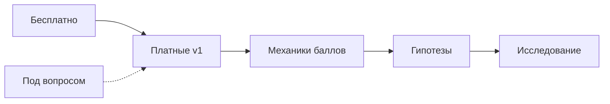

# Портфель монетизации Astra

> **Hub-заметка.** Детальные оценки → [[оценка идей монетизации Astra 2026-06-13]]  
> PDF для коллеги → `docs/monetization/Astra-портфель-монетизации-2026-06-13.pdf`  
> Бэклог задач → `spec/backlog.md` (P3)

## Контекст

| | |
|---|---|
| **Продукт** | Telegram-бот Astra — ежедневные персональные предсказания (RU) |
| **ЦА** | Женщины, «магическое мышление»; совместимость, будущее, решения |
| **MVP сейчас** | Бесплатно; баллы за визиты и рефералов |
| **Ограничения** | Solo-dev; сервер deadtiger (CPU-only LLM ≤4B, генерация в фоне) |
| **Цель** | ~100k платящих × 100₽ ≈ 10 млн₽/мес |

## Шкала оценок (1–5)

| Метрика | 1 | 5 |
|---------|---|---|
| **Сложность** | быстро, переиспользуем код | месяцы, новый стек |
| **ЦА** | мимо аудитории | прямое попадание |
| **Монетизация** | сложно продать | импульс / подписка / высокий чек |
| **Популярность** | ниша | массовый запрос в RU эзотерике |
| **Спрос** | nice to have | «хочу прямо сейчас» |

**Приоритет:** `(ЦА + Монет + Спрос + Попул) − Сложность`

---

## Статусы портфеля

| Статус | Кол-во | Что значит |
|--------|:------:|------------|
| ✅ Платное v1 | 22 | Утверждено к реализации |
| 🎁 Бесплатно | 1 | Маркетинг / retention |
| 🧪 Гипотеза | 2 | Нужен spike / A/B |
| 🔍 Исследование | 2 | Нравится, нужен план |
| ⏸ Под вопросом | 9 | Плюсы/минусы, вернуться позже |

---

## ✅ Платное v1 (22)

### Подписка

| # | Продукт | Сложн. | ЦА | Монет. | Попул. | Спрос | Цена ₽ |
|---|---------|:------:|:--:|:------:|:------:|:-----:|--------|
| 1 | Premium-подписка | 3 | 4 | 5 | 5 | 4 | 199–399/мес |

### Разборы (астрология)

| # | Продукт | Сложн. | ЦА | Монет. | Попул. | Спрос | Цена ₽ |
|---|---------|:------:|:--:|:------:|:------:|:-----:|--------|
| 6 | Натал (краткий) | 4 | 5 | 4 | 5 | 5 | 349–599 |
| 7 | Натал (полный) | 5 | 5 | 4 | 4 | 4 | 799–1499 |
| 8 | Совместимость пары | 4 | 5 | 5 | 5 | 5 | 499–999 |
| 9 | Совместимость «я + он/она» | 3 | 5 | 5 | 5 | 5 | 349–799 |
| 10 | Прогноз на месяц | 3 | 4 | 4 | 4 | 4 | 249–499 |
| 11 | Прогноз на год | 3 | 4 | 4 | 4 | 3 | 599–999 |
| 12 | Разбор транзита | 2 | 3 | 3 | 3 | 3 | 149–349 |
| 13 | Карьерный разбор | 3 | 3 | 3 | 3 | 3 | 299–599 |
| 14 | Любовный разбор | 3 | 5 | 5 | 5 | 5 | 349–699 |
| 15 | «Вопрос дня» | 2 | 4 | 5 | 4 | 4 | 99–199 |

### Таро и нумерология

| # | Продукт | Сложн. | ЦА | Монет. | Попул. | Спрос | Цена ₽ |
|---|---------|:------:|:--:|:------:|:------:|:-----:|--------|
| 16 | Таро: 3 карты | 3 | 4 | 4 | 5 | 5 | 149–299 |
| 17 | Таро: отношения | 3 | 5 | 5 | 5 | 5 | 199–399 |
| 18 | Таро: решение | 3 | 4 | 4 | 4 | 4 | 149–299 |
| 19 | Карта дня Premium | 2 | 4 | 3 | 3 | 3 | 99–149 |
| 20 | Нумерология | 3 | 4 | 4 | 4 | 4 | 199–399 |

### Premium-формат

| # | Продукт | Сложн. | ЦА | Монет. | Попул. | Спрос | Цена ₽ |
|---|---------|:------:|:--:|:------:|:------:|:-----:|--------|
| 41 | Видео-предсказание совместимости | 5 | 5 | 5 | 5 | 5 | 699–1999 |

> #41 в портфеле, но **не v1** — рендер не на deadtiger. См. MON-H2.

### Механики (не отдельный продукт)

| # | Механика | Сложн. | ЦА | Монет. | Попул. | Спрос |
|---|----------|:------:|:--:|:------:|:------:|:-----:|
| 26 | Оплата баллами | 3 | 4 | 4 | 4 | 4 |
| 27 | Баллы + доплата | 3 | 4 | 5 | 4 | 4 |
| 28 | Реферальный бонус | 2 | 4 | 3 | 4 | 4 |
| 29 | Streak-награды | 2 | 4 | 2 | 4 | 3 |
| 30 | Лутбокс | 3 | 3 | 3 | 3 | 2 |

---

## 🎁 Бесплатно (1)

| # | Продукт | Сложн. | ЦА | Монет.* | Попул. | Спрос | Задача |
|---|---------|:------:|:--:|:-------:|:------:|:-----:|--------|
| 35 | PDF-книга года на ДР | 4 | 5 | 2 | 4 | 4 | MON-F1 |

\*Косвенная монетизация через retention и upsell.

---

## 🧪 Гипотезы (2)

| # | Продукт | Сложн. | ЦА | Монет. | Попул. | Спрос | Цена ₽ | ID |
|---|---------|:------:|:--:|:------:|:------:|:-----:|--------|-----|
| 37 | Аудио-прогноз (TTS Astrid) | 4 | 4 | 3 | 4 | 3 | +49–99 | MON-H1 |
| 41 | Видео совместимости | 5 | 5 | 5 | 5 | 5 | 699–1999 | MON-H2 |

---

## 🔍 Исследование (2)

| # | Идея | Сложн. | ЦА | Монет. | Следующий шаг | ID |
|---|------|:------:|:--:|:------:|---------------|-----|
| 39 | Affiliate (курсы, украшения) | 2 | 3 | 4 | Admitad / прямые; UX без спама | MON-R1 |
| 40 | White-label для блогеров | 5 | 2 | 4 | Bot token, биллинг, MVP на 1 блогера | MON-R2 |

---

## ⏸ Под вопросом (9)

| ID | # | Продукт | Сложн. | ЦА | Монет. | Попул. | Спрос | Цена ₽ | Плюсы | Минусы |
|----|---|---------|:------:|:--:|:------:|:------:|:-----:|--------|-------|--------|
| MON-Q1 | 21 | Пакет «Старт» | 3 | 5 | 4 | 4 | 4 | 899–1299 | ↑ чек | прайсинг |
| MON-Q2 | 22 | Пакет «Отношения» | 3 | 5 | 5 | 5 | 5 | 999–1499 | core ЦА | нужны базовые разборы |
| MON-Q3 | 23 | Пакет «Год вперёд» | 4 | 4 | 4 | 4 | 3 | 1499–2499 | LTV | апдейты |
| MON-Q4 | 24 | Семейный пакет | 4 | 4 | 4 | 3 | 3 | 499–799/мес | ARPU | UX-5 |
| MON-Q5 | 25 | B2B wellness | 5 | 2 | 3 | 2 | 2 | 50k+ | чеки | не core |
| MON-Q6 | 31 | Живой астролог | 4 | 5 | 5 | 4 | 4 | 1500–5000 | маржа | supply |
| MON-Q7 | 32 | Second opinion | 5 | 4 | 4 | 3 | 3 | 999–1999 | дифф. | SLA |
| MON-Q8 | 33 | Групповой эфир | 4 | 4 | 3 | 3 | 3 | 299–999 | масштаб | аудитория |
| MON-Q9 | 34 | Куратор неделя | 5 | 4 | 4 | 2 | 2 | 2999+ | premium | не масштаб |

---

## Приоритет запуска v1

| Ранг | # | Продукт | Балл |
|:----:|---|---------|:----:|
| 1 | 9 | Совместимость «я + он/она» | 17 |
| 1 | 14 | Любовный разбор | 17 |
| 1 | 17 | Таро: отношения | 17 |
| 4 | 8 | Совместимость пары | 16 |
| 4 | 15 | «Вопрос дня» | 16 |
| 4 | 41 | Видео совместимости | 16* |
| 7 | 16 | Таро: 3 карты | 15 |

**Очередь:** 15 → 9 → 14 → 17 → 16 → 1 → 26/27. Гипотезы 37/41 — после первых продаж.

---

## Вопросы для коллеги

1. Адекватны ли ценовые диапазоны для RU Telegram?
2. Пакеты 21–23 — включать в v1 или ждать отдельных продуктов?
3. Видео #41 — premium сразу или freemium-тизер (15 сек)?
4. Экономика баллов: какой % чека можно покрывать баллами без убытка?
5. Affiliate / white-label — откладываем до 200k₽/мес или раньше?

## Связи

- [[продукт Astra telegram предсказания RU аудитория]]
- [[оценка идей монетизации Astra 2026-06-13]]
